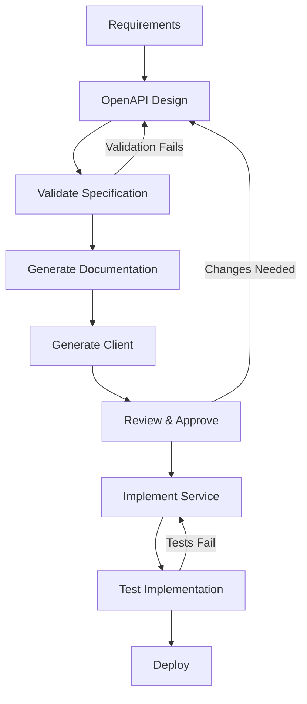

# API Development - Getting Started Guide

This guide walks you through developing APIs in the Enterprise SaaS Template
using our API-first approach.

## 🎯 Quick Start

### 1. Create Your API Specification

Start by defining your API using OpenAPI 3.0:

```bash
# Create a new service (if needed)
pnpm run generate:service my-service

# Edit the OpenAPI specification
code services/my-service/docs/openapi.yaml
```

Use our template as a starting point:

```bash
# Copy the template
cp docs/templates/openapi-template.yaml services/my-service/docs/openapi.yaml

# Replace placeholders with actual values
# [SERVICE_NAME] -> My Service
# [PORT] -> 3002
# etc.
```

### 2. Validate Your Specification

```bash
# Validate specific service
swagger-codegen validate -i services/my-service/docs/openapi.yaml

# Validate all services
pnpm run docs:validate:all
```

### 3. Generate Documentation

```bash
# Generate documentation for all services
pnpm run docs:generate:all

# Serve documentation locally
cd docs/generated && python -m http.server 8080
# Visit: http://localhost:8080
```

### 4. Generate TypeScript Client

```bash
# Generate clients for all services
pnpm run client:generate:all

# Build the api-client library
cd libs/api-client && pnpm run build
```

### 5. Implement Your Service

Follow the generated specification to implement your service:

```typescript
// services/my-service/src/routes/my-resource.routes.ts
import { Router } from 'express';
import { MyResourceController } from '../controllers/my-resource.controller';

const router = Router();
const controller = new MyResourceController();

// Implement according to your OpenAPI spec
router.get('/', controller.list);
router.post('/', controller.create);
router.get('/:id', controller.get);
router.put('/:id', controller.update);
router.delete('/:id', controller.delete);

export { router as myResourceRoutes };
```

## 📋 API Design Checklist

### Before You Start

- [ ] Review existing APIs for consistency
- [ ] Understand the business requirements
- [ ] Plan your resource model
- [ ] Consider security requirements
- [ ] Plan for versioning

### During Design

- [ ] Follow RESTful principles
- [ ] Use consistent naming conventions
- [ ] Define proper HTTP status codes
- [ ] Include comprehensive examples
- [ ] Document all error cases
- [ ] Add rate limiting information
- [ ] Specify authentication requirements

### After Design

- [ ] Validate OpenAPI specification
- [ ] Generate and review documentation
- [ ] Generate TypeScript client
- [ ] Implement according to specification
- [ ] Add comprehensive tests
- [ ] Update integration documentation

## 🛠️ Development Workflow

### API-First Development Process



### Example: Adding a New Endpoint

1. **Add to OpenAPI specification:**

```yaml
paths:
  /users/{id}/preferences:
    get:
      tags:
        - Users
      summary: Get user preferences
      parameters:
        - name: id
          in: path
          required: true
          schema:
            type: string
            format: uuid
      responses:
        '200':
          description: User preferences
          content:
            application/json:
              schema:
                $ref: '#/components/schemas/UserPreferences'
```

2. **Validate and generate:**

```bash
pnpm run docs:validate
pnpm run docs:generate:all
pnpm run client:generate:all
```

3. **Implement the endpoint:**

```typescript
// Add to your controller
async getPreferences(req: Request, res: Response) {
  const { id } = req.params;
  const preferences = await this.userService.getPreferences(id);

  res.json({
    success: true,
    data: preferences,
    meta: {
      timestamp: new Date().toISOString(),
      requestId: req.correlationId,
    },
  });
}
```

4. **Test the implementation:**

```typescript
// Add tests that verify the API matches the specification
describe('GET /users/:id/preferences', () => {
  it('should return user preferences according to schema', async () => {
    const response = await request(app)
      .get('/users/550e8400-e29b-41d4-a716-446655440000/preferences')
      .expect(200);

    // Validate response matches OpenAPI schema
    expect(response.body).toMatchSchema(userPreferencesSchema);
  });
});
```

## 🔧 Common Tasks

### Adding Authentication to an Endpoint

```yaml
# In your OpenAPI spec
paths:
  /protected-endpoint:
    get:
      security:
        - bearerAuth: []
      # ... rest of definition
```

### Adding Pagination

```yaml
# Parameters
parameters:
  - $ref: '#/components/parameters/PageParam'
  - $ref: '#/components/parameters/LimitParam'

# Response
responses:
  '200':
    content:
      application/json:
        schema:
          allOf:
            - $ref: '#/components/schemas/ApiResponse'
            - type: object
              properties:
                data:
                  type: object
                  properties:
                    items:
                      type: array
                      items:
                        $ref: '#/components/schemas/YourResource'
                    pagination:
                      $ref: '#/components/schemas/PaginationMeta'
```

### Adding Request Validation

```yaml
# Request body with validation
requestBody:
  required: true
  content:
    application/json:
      schema:
        type: object
        required:
          - email
          - name
        properties:
          email:
            type: string
            format: email
            maxLength: 255
          name:
            type: string
            minLength: 1
            maxLength: 100
```

### Adding Error Responses

```yaml
responses:
  '400':
    $ref: '#/components/responses/ValidationError'
  '401':
    $ref: '#/components/responses/UnauthorizedError'
  '404':
    $ref: '#/components/responses/NotFoundError'
  '500':
    $ref: '#/components/responses/InternalServerError'
```

## 🧪 Testing Your API

### Schema Validation Testing

```typescript
import { validateResponse } from './test-utils/schema-validator';

describe('API Schema Validation', () => {
  it('should match OpenAPI schema', async () => {
    const response = await request(app).get('/api/v1/users').expect(200);

    // Validate against OpenAPI schema
    const isValid = validateResponse(
      'get',
      '/users',
      response.status,
      response.body
    );

    expect(isValid).toBe(true);
  });
});
```

### Contract Testing

```typescript
import { Pact } from '@pact-foundation/pact';

describe('User Service Contract', () => {
  const provider = new Pact({
    consumer: 'Web App',
    provider: 'User Service',
    port: 1234,
  });

  it('should get user profile', async () => {
    await provider
      .given('user exists')
      .uponReceiving('a request for user profile')
      .withRequest({
        method: 'GET',
        path: '/users/123/profile',
        headers: {
          Authorization: 'Bearer token',
        },
      })
      .willRespondWith({
        status: 200,
        headers: {
          'Content-Type': 'application/json',
        },
        body: {
          success: true,
          data: {
            id: '123',
            email: 'user@example.com',
            firstName: 'John',
            lastName: 'Doe',
          },
        },
      });

    // Test implementation
  });
});
```

## 📚 Tools and Resources

### Required Tools

- **OpenAPI Generator**: Client and documentation generation
- **Swagger Codegen**: Specification validation
- **Redoc CLI**: Beautiful documentation generation

### Recommended Extensions

- **VS Code**: 42Crunch OpenAPI extension
- **Postman**: OpenAPI import and testing
- **Insomnia**: API client with OpenAPI support

### Useful Commands

```bash
# Documentation
pnpm run docs:validate          # Validate single service
pnpm run docs:validate:all      # Validate all services
pnpm run docs:generate:all      # Generate all documentation
pnpm run docs:serve            # Serve documentation locally

# Client Generation
pnpm run client:generate        # Generate single client
pnpm run client:generate:all    # Generate all clients

# Development
pnpm run dev                   # Start all services
pnpm run test                  # Run all tests
pnpm run lint                  # Lint all code
```

## 🔍 Troubleshooting

### Common Issues

#### OpenAPI Validation Fails

```bash
# Error: Invalid reference
# Solution: Check all $ref paths are correct
grep -r "\$ref" services/my-service/docs/openapi.yaml
```

#### Client Generation Fails

```bash
# Error: Unknown format 'uuid'
# Solution: Use string type with format
type: string
format: uuid
```

#### Documentation Not Updating

```bash
# Clear generated docs and regenerate
rm -rf docs/generated
pnpm run docs:generate:all
```

### Getting Help

1. **Check OpenAPI specification**: Validate syntax and references
2. **Review generated documentation**: Ensure it matches expectations
3. **Test generated clients**: Verify they work as expected
4. **Check logs**: Look for validation or generation errors

## 🎯 Best Practices

### API Design

- ✅ Use nouns for resources, verbs for actions
- ✅ Be consistent with naming conventions
- ✅ Include comprehensive examples
- ✅ Document all error scenarios
- ✅ Use semantic versioning

### OpenAPI Specifications

- ✅ Start with the template
- ✅ Use external references for common schemas
- ✅ Include detailed descriptions
- ✅ Provide multiple examples
- ✅ Validate frequently during development

### Development Workflow

- ✅ Design first, implement second
- ✅ Generate clients early in development
- ✅ Test against the specification
- ✅ Update documentation with changes
- ✅ Review generated documentation before release

## 🚀 Next Steps

1. **Explore the authentication service** specification as an example
2. **Create your first API** using the template
3. **Generate documentation and clients** to see the workflow
4. **Implement your service** following the specification
5. **Add comprehensive tests** to ensure quality

Happy API development! 🎉
